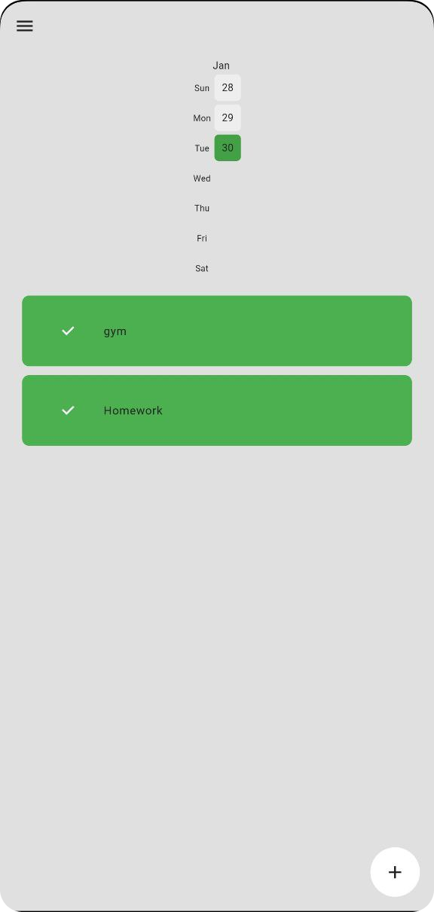
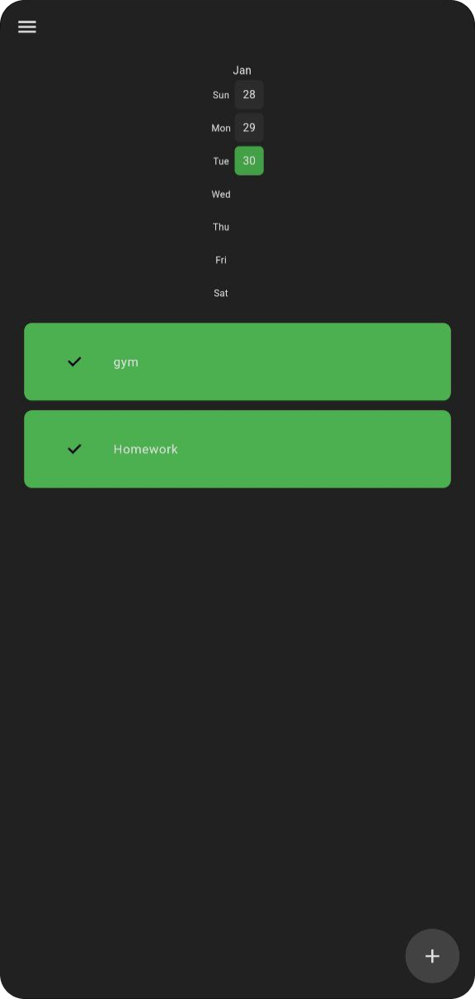

# Habit Tracker 📅

## Introduction 🚀
Welcome to the Habit Tracker app, a powerful and intuitive mobile application built using Flutter and Dart. This app helps you build and maintain positive habits by providing a sleek and user-friendly interface for tracking your daily routines. With the added feature of a heatmap and Isar database integration, managing your habits has never been this delightful!

## Features 🎉
- **💾 Isar Database Integration:** We leverage Isar, a high-performance, easy-to-use NoSQL database for Flutter, to store and retrieve your habit data seamlessly. Isar's efficient data handling ensures quick access to your habit information.
- **📊 Heatmap Visualization:**  Gain insights into your habit progress with the interactive heatmap. Easily identify trends and patterns in your habits over time, helping you stay motivated and focused.
- **🌞🌑Light and Dark Mode:**  Personalize your experience with light and dark mode options. Switch between themes effortlessly to suit your preferences and reduce eye strain during different times of the day.

## Getting Started 🛠️

1. **Clone the Repository:**

   ```bash
   git clone https://github.com/aryamanshrivastava/Habit_Tracker.git
   
2. **Navigate to the project directory:**

    ```bash
    cd habit_tracker

3. **Install Dependencies:**
    ```bash
    flutter pub get

4. **Run the App:**
    ```bash
    flutter run

## Screenshots 📸

| Light Mode | Dark Mode |
|------------|-----------|
|  |  |


## Technologies Used 🧪

**Flutter & Dart**

**ISAR Database**

**Heatmap Calendar**

## Set Up ISAR DATABASE 🖥️

1. **Add dependencies**

   ```bash
   flutter pub add isar isar_flutter_libs path_provider
   flutter pub add -d isar_generator build_runner

2. **Run Code Generator**

   ```bash
   flutter pub run build_runner build 

  For more information, see [Isar Documentation](https://isar.dev/tutorials/quickstart.html).

## License 📜
Distributed under the MIT License. See [LICENSE](https://github.com/aryamanshrivastava/Habit_Tracker/blob/main/LICENSE) for more information.

## Contact 📫
🎉Aryaman Shrivastava - shrivastavaaryaman0702@gmail.com

If you find this app helpful, don't forget to star the repository! ⭐️

